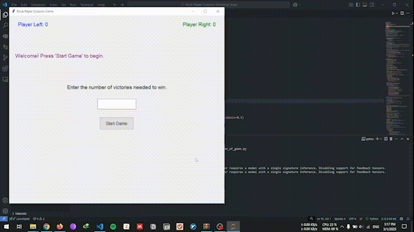

# **Rock–Paper–Scissors Game Automation with YOLOv11**  

For a full report with results, please refer to the [Final Report](https://github.com/SBUformers/Rock-Paper-Scissors-Simulator/blob/main/Final_report.pdf).

Real-time hand gesture detection to power a fully automated and interactive Rock–Paper–Scissors game—complete with **cheating detection** and **winner celebration**.



> In the demo above, YOLOv11 detects each player's gesture (Rock, Paper, or Scissors). The **left player** wins, so a separate model locates that player's face and places a **crown** on their head. Meanwhile, the **cheater** (caught changing their gesture post-countdown) receives a penalty of **–1 point** and has a **red mask** over their face.

## Table of Contents
1. [Introduction](#1-introduction)
2. [Game Rules](#2-game-rules)
3. [Project Overview](#3-project-overview)
    - [Objective](#objective)
    - [Key Features](#key-features)
4. [Dataset and Model Training](#4-dataset-and-model-training)
5. [System Components](#5-system-components)
6. [Game Flow](#6-game-flow)
7. [Cheating Detection & Winner Celebration](#7-cheating-detection--winner-celebration)
8. [Usage](#8-usage)
9. [Results](#9-results)
10. [Future Work](#10-future-work)
11. [License](#11-license)

## 1. Introduction
This project showcases an end-to-end pipeline for **real-time hand gesture detection** and **automated gameplay** of Rock–Paper–Scissors using **YOLOv11**. Beyond mere detection, we’ve added:
- **Cheating Detection**: Players changing their gesture after the countdown are penalized.
- **Dynamic Winner Recognition**: The winning player is visually celebrated with a **crown** overlay.

By blending **object detection**, **facial landmark tracking**, and **interactive overlays**, the game seamlessly combines **computer vision** with **fun**.

## 2. Game Rules

Adapted from our project outline (see *FinalProject-CV.pdf*), the essential Rock–Paper–Scissors rules are:

1. **Rock vs. Scissors** → Rock **crushes** Scissors.
2. **Scissors vs. Paper** → Scissors **cuts** Paper.
3. **Paper vs. Rock** → Paper **covers** Rock.

Additional constraints:
- **Countdown Start**: Players must begin each round showing a **Rock** (fist) as the system counts down.
- **Final Reveal**: At the end of the countdown, the *visible* hand gesture is locked in.
- **Cheating**: If a player changes their gesture post-countdown, the system penalizes that player **–1 point** and applies a **red face mask**.

## 3. Project Overview

### Objective
- **Detect** Rock, Paper, or Scissors hand gestures in real-time using YOLOv11.
- **Automate** the standard RPS game flow:
  - Countdown → Reveal → Compare → Announce winner.
- **Enforce** fair play via cheat detection.
- **Provide** instant **winner celebration** with a crown overlay on the victor.

### Key Features
- **YOLOv11 Object Detection**  
  Fine-tuned to recognize hand gestures at high accuracy and speed.
- **Face Landmark Tracking**  
  Utilized to overlay a **red mask** for cheaters or a **golden crown** for the winner.
- **Interactive Interface**  
  Displays bounding boxes, facial overlays, and real-time scoring feedback.

## 4. Dataset and Model Training

1. **Data Collection & Annotation**  
   - Approximately **9,000** images of **Rock**, **Paper**, **Scissors** gestures from diverse lighting, backgrounds, and hand positions.
   - Annotated via **Roboflow** with bounding boxes for each gesture class.

2. **Preprocessing & Augmentation**  
   - **Resizing** to 640×640.
   - **Random flips**, **rotations**, **brightness** and **saturation** adjustments.
   - Balanced classes to mitigate overfitting (particularly “Rock,” which appears more often naturally).

3. **Model**: **YOLOv11**  
   - **Transfer Learning** used from existing YOLOv11 weights.
   - **Trained on GPU** (Kaggle/Colab) for ~250 epochs.
   - Achieved **mAP@0.5 ~ 0.982** on the final dataset.

4. **Output**:  
   - Model weights: `yolov11/rps_best.pt` (example filename).
   - Strong detection for all three gestures in real-time.

## 5. System Components

1. **YOLOv11 Detector**  
   - Inference script for **Rock–Paper–Scissors** gestures.

2. **Face Detection & Landmark Tracking**  
   - **Mediapipe** or **Dlib** used to locate faces and key points for overlaying masks/crowns.

3. **Game Logic**  
   - Tracking game states:
     1. **Countdown**
     2. **Lock gestures**
     3. **Compare**
     4. **Announce winner**
   - If a gesture changes after the lock → **cheater** status triggered.

4. **Overlay & Visualization**  
   - **OpenCV** used for bounding boxes, text labels, drawing shapes (crown, mask), and providing feedback (score updates).

## 6. Game Flow

1. **Startup**  
   - Players stand in frame, each with a **Rock (fist)** to initialize.
2. **Countdown**  
   - The system visually counts down (e.g., 4… 3… 2… 1…).
3. **Gesture Reveal**  
   - YOLOv11 inspects final gestures (Rock, Paper, or Scissors).
4. **Compare Gestures**  
   - Standard RPS logic → Winner determined or tie recognized.
5. **Output**  
   - Winner gets a crown overlay and **+1** point.
   - Cheater’s face is masked red and **–1** point is applied.

## 7. Cheating Detection & Winner Celebration

- **Cheating**:  
  - If the model detects a change in gesture *after* the countdown ends, that player is flagged.
  - The flagged player’s face is instantly overlaid with a **red mask** (see `assets/masks/red_mask.png`) and –1 point is assigned.

- **Winner Overlay**:  
  - Once a winner is identified, a **golden crown** is placed above their head in real time (see `assets/crowns/crown.png`).
  - A quick zoom effect or highlight signals victory.

## 8. Usage

1. **Run the Game**  
   ```bash
   python game/main_game.py
   ```
2. **Webcam/Video**  
   - By default, `main_game.py` uses your **webcam** to detect gestures.
   - To test on a recorded video, modify the script’s input source to `video.mp4`.

3. **Gameplay**  
   - Position both players so that their hands and faces are visible to the camera.
   - Once the program starts, the game runs a countdown.
   - Keep your gesture consistent until the round ends—**or get flagged**!

## 9. Results

- **Detection Accuracy**: ~98.2% mAP@0.5 (Paper, Rock, Scissors).
- **Real-Time FPS**: ~20–25 FPS on a moderate GPU.
- **Cheating Scenarios**: Successfully flagged post-countdown gesture changes with a *red mask*.
- **Winner Overlay**: Correctly awarded the **crown** to the highest scoring player.

See the top of this README for a live **GIF** demonstration (`results/performance.gif`).

## 10. Future Work

- **Expand Gesture Set**: Include Lizard and Spock (extending the game).
- **Multi-Round Tournaments**: Track multiple rounds and overall champion.
- **Improve Cheating Detection**: Add advanced boundary rules (e.g., track hand path).
- **UI/UX Enhancements**: On-screen scoreboard, animations, optional crowd cheering audio.

## 11. License

This project is open-sourced under the [MIT License](LICENSE).  
Feel free to fork, modify, and distribute—just cite us or give a link back!

**Enjoy the game!** If you find this project helpful or fun, please consider **starring** the repo ⭐ and sharing your feedback.
